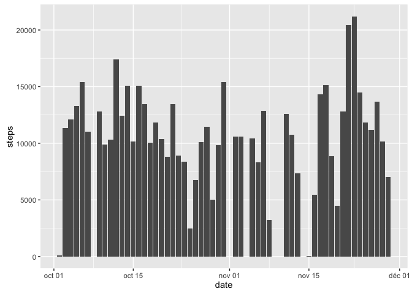
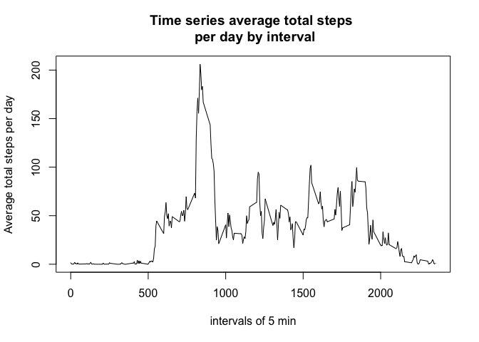
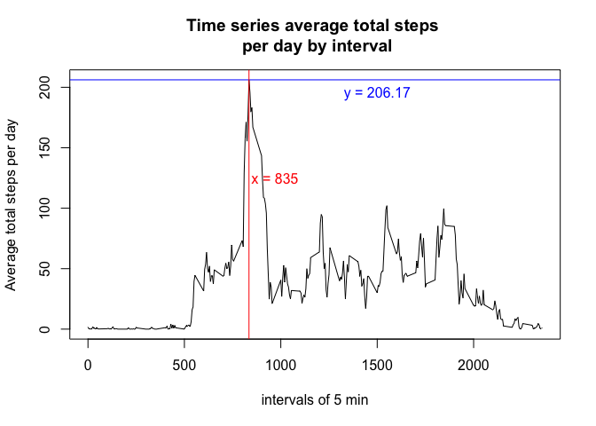
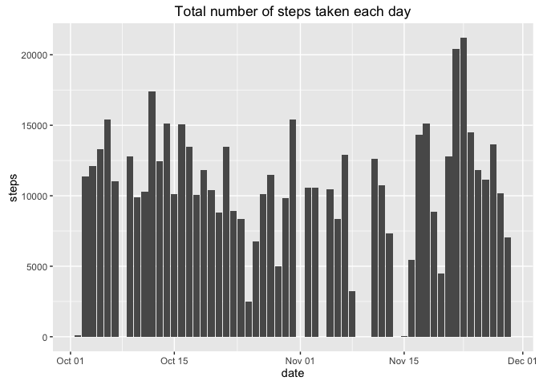
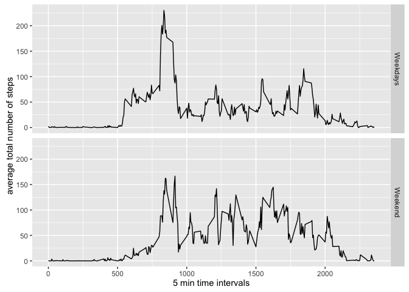
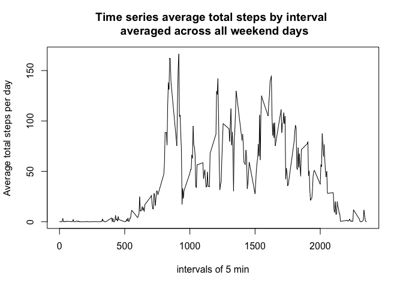
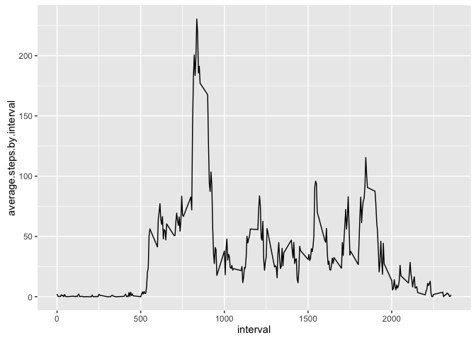
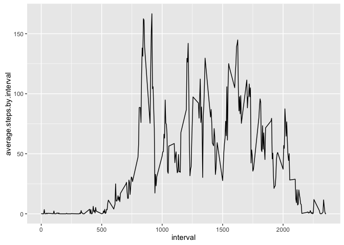
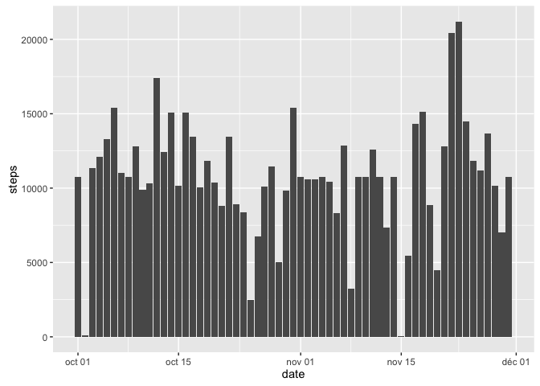

# Reproducible Research: Peer Assessment 1
Georges Bressange  


## Loading and preprocessing the data
1. The zip file, as stated in the peer assesment instructions, is already 
present in the working directory. We unzip it:


```r
unzip("activity.zip")
```

Then, we read the zip file to produce the analytic data frame we will 
later use to perform statistic analysis:


```r
activity <- read.csv("activity.csv")
```

2. We convert the factor "date" to a date format:


```r
activity$date <- as.Date(activity$date, format = "%Y-%m-%d")
```

Let us visualize now the structure of the "activity" data frame:


```r
str(activity)
```

```
## 'data.frame':	17568 obs. of  3 variables:
##  $ steps   : int  NA NA NA NA NA NA NA NA NA NA ...
##  $ date    : Date, format: "2012-10-01" "2012-10-01" ...
##  $ interval: int  0 5 10 15 20 25 30 35 40 45 ...
```
 
## What is mean total number of steps taken per day?
1. Let us calculate the total number of steps taken per day in "activity":


```r
library(dplyr)
```

```
## 
## Attaching package: 'dplyr'
```

```
## The following objects are masked from 'package:stats':
## 
##     filter, lag
```

```
## The following objects are masked from 'package:base':
## 
##     intersect, setdiff, setequal, union
```

```r
totalnumbersteps1 <- summarise(group_by(activity, date), total.steps.daily = sum(steps, na.rm = TRUE))
head(totalnumbersteps1)
```

```
## # A tibble: 6 x 2
##         date total.steps.daily
##       <date>             <int>
## 1 2012-10-01                 0
## 2 2012-10-02               126
## 3 2012-10-03             11352
## 4 2012-10-04             12116
## 5 2012-10-05             13294
## 6 2012-10-06             15420
```

2. We now plot an histogram of the total number of steps taken each day using 
ggplot2 (we have interpreted "each day" as "each of the 61 days" since the 
instructions don't ask for "each day of the week"). NA values have been 
ignored. A word on the differences between histogram and barplot: an histogram 
is used to describe the ditribution of one quantitaive variable. A barplot is used 
to compare several categorical vairables. Here, we want to study the distribution 
of the "steps" variable but this variable is partially already counted so we 
have used a barplot to be able to specify the counted steps on the y-axis.


```r
library(ggplot2)
g <- ggplot(data = activity, aes(date, steps))
g + stat_summary(fun.y = sum, geom = "bar", na.rm = TRUE)
```

<!-- -->
 
3. We now report the mean and median total number of steps taken per day. The dplyr 
package has already been loaded. We summarize with the following naming: 
the mean total number of steps per day is "mean.steps.daily" and the  the median 
total number of steps per day is "median.steps.daily":


```r
report1 <- summarise(activity, mean.steps.daily = mean(steps, na.rm = TRUE),
                 median.steps.daily = median(steps, na.rm = TRUE))
report1
```

```
##   mean.steps.daily median.steps.daily
## 1          37.3826                  0
```
The anonymous individual performs around 37 steps 
per day and the fact that the median total number of steps per day is zero means 
that for at least 50% of the days in these two months, the anonymous individual 
don't perform any step.

## What is the average daily activity pattern?
1. We group similar interval of 5 mins along the days. The resulting data frame 
is called "activity_by_intervals".


```r
activity_by_intervals <- aggregate(activity, by = list(activity$interval), 
                             FUN = "mean", na.rm = TRUE)
activity_by_intervals <- select(activity_by_intervals, interval, steps)
activity_by_intervals <- rename(activity_by_intervals, 
                                average.steps.by.interval = steps)
head(activity_by_intervals,10)
```

```
##    interval average.steps.by.interval
## 1         0                 1.7169811
## 2         5                 0.3396226
## 3        10                 0.1320755
## 4        15                 0.1509434
## 5        20                 0.0754717
## 6        25                 2.0943396
## 7        30                 0.5283019
## 8        35                 0.8679245
## 9        40                 0.0000000
## 10       45                 1.4716981
```

We now make a time series plot (type = "l") of the 5-minute interval (x-axis) and 
the average number of steps taken, averaged across all days (y-axis)


```r
plot(activity_by_intervals$interval, activity_by_intervals$average.steps.by.interval, 
     type = "l", xlab = "intervals of 5 min", 
     ylab = "Average total steps per day", 
     main ="Time series average total steps \n per day by interval")
```

<!-- -->
2. The 5-minute interval, on average across all the days in the dataset, 
contains the maximum number of steps can be obtained by the following 
commands, performed on the dataset "activity_by_intervals":


```r
M <- max(activity_by_intervals$average.steps.by.interval) ## calculates the maximum average steps in the series of intervals
n <- activity_by_intervals[
        activity_by_intervals$average.steps.by.interval == M,]$interval ## gives the time interval where this maximum occurs
activity_by_intervals[activity_by_intervals$average.steps.by.interval == M,]
```

```
##     interval average.steps.by.interval
## 104      835                  206.1698
```

The 5-minute interval, on average across all the days in the dataset, 
that contains the maximum number of steps is the interval 835 i.e., after 
time conversion, between 13h55 and 14h00. To confirm that, we ploted again 
the time series presented in 1. by adding a blue horizontal line 
corresponding to the maximum of steps (y = 206.1698113) end a red vertical line 
corresponding to the interval where this maximum occurs (x = 835).


```r
plot(activity_by_intervals$interval, activity_by_intervals$average.steps.by.interval, 
     type = "l", xlab = "intervals of 5 min", 
     ylab = "Average total steps per day", 
     main ="Time series average total steps \n per day by interval")
abline(h = M, col = "blue")
abline(v = n, col = "red")
text(x = 1500, y = 195, labels = "y = 206.17", col = "blue")
text(x = 970, y = 125, labels = "x = 835", col = "red")
```

<!-- -->

## Imputing missing values
1. Calculate and report the total number of missing values in the dataset 


```r
nasteps <- sum(is.na(activity$steps)) # number of NA in steps column
nadate <- sum(is.na(activity$date)) # number of NA in date column
nainterval <- sum(is.na(activity$interval)) # number of NA in interval column
nas <- data.frame(nasteps, nadate, nainterval)
nas
```

```
##   nasteps nadate nainterval
## 1    2304      0          0
```

The dataset "activity" contains 2304 missing values in total. These 
NA values are exclusively located in the "steps" column. This number of missing values can also be read from the summary command applied to "activity":


```r
summary(activity)
```

```
##      steps             date               interval     
##  Min.   :  0.00   Min.   :2012-10-01   Min.   :   0.0  
##  1st Qu.:  0.00   1st Qu.:2012-10-16   1st Qu.: 588.8  
##  Median :  0.00   Median :2012-10-31   Median :1177.5  
##  Mean   : 37.38   Mean   :2012-10-31   Mean   :1177.5  
##  3rd Qu.: 12.00   3rd Qu.:2012-11-15   3rd Qu.:1766.2  
##  Max.   :806.00   Max.   :2012-11-30   Max.   :2355.0  
##  NA's   :2304
```

2. Strategy for filling in all of the missing values in the dataset. 

We decide to replace each missing steps value by the mean of the 5-minute interval 
they belong.

3. Creating a new dataset "activityfill" that is equal to the original dataset but with the missing data filled in.


```r
activityfill <- activity ## creating a new dataset
listNAintervals <- activityfill$interval[is.na(activityfill$steps)] ## list the values of time intervals corresponding to the missing steps values
f <- function(x){
        subset(activity_by_intervals, interval == x)$average.steps.by.interval
} 
activityfill$steps[is.na(activityfill$steps)] <- sapply(listNAintervals, f) ## the function f will replace each missing steps value in "activity" by the corresponding average.steps.by.interval extracted from "activity_by_intervals".
```

4. Histogram of the total number of steps taken each day:
We use the same plot command as used for "activity" dataset.


```r
g <- ggplot(data = activityfill, aes(date, steps))
g + stat_summary(fun.y = sum, geom = "bar", na.rm = TRUE)
```

<!-- -->

We now report the mean and median total number of steps taken per day. 


```r
report2 <- summarise(activityfill, mean.steps.daily = mean(steps, na.rm = TRUE),
                 median.steps.daily = median(steps, na.rm = TRUE))
report2
```

```
##   mean.steps.daily median.steps.daily
## 1          37.3826                  0
```

These values don't differ from the estimates from the first part of the assignment.

Let us calculate the total number of steps taken per day in "activityfill":


```r
totalnumbersteps2 <- summarise(group_by(activityfill, date), total.steps.daily = sum(steps, na.rm = TRUE))
head(totalnumbersteps2)
```

```
## # A tibble: 6 x 2
##         date total.steps.daily
##       <date>             <dbl>
## 1 2012-10-01          10766.19
## 2 2012-10-02            126.00
## 3 2012-10-03          11352.00
## 4 2012-10-04          12116.00
## 5 2012-10-05          13294.00
## 6 2012-10-06          15420.00
```
As a result of imputing missing values, we calculate below increase of the total number of steps per day:


```r
impactfill <- data.frame(date = totalnumbersteps1$date, 
                      daily.increase = totalnumbersteps2$total.steps.daily - 
                              totalnumbersteps1$total.steps.daily)
report3 <- summarise(impactfill, mean.daily.increase = mean(daily.increase), 
          median.daily.increase = median(daily.increase))
meanincreasesteps <- report3$mean.daily.increase
head(report3)
```

```
##   mean.daily.increase median.daily.increase
## 1            1411.959                     0
```

Therefore, we see that in average, the daily total number of steps has increased from 
around 1412 steps.

## Are there differences in activity patterns between weekdays and weekends?

1. We create a new factor variable in the dataset with two levels – “weekday” and “weekend” indicating whether a given date is a weekday or weekend day.

The following code is useful because my locales are french and I want to obtain weekdays in english.


```r
curr_locale <- Sys.getlocale("LC_TIME")
Sys.setlocale("LC_TIME","en_US.UTF-8")
```

```
## [1] "en_US.UTF-8"
```
Creating the weekdays factor variable:


```r
weekdayslist <- c('Monday', 'Tuesday', 'Wednesday', 'Thursday', 'Friday')
activityfill$weekDay <- factor((weekdays(activityfill$date) %in% weekdayslist), 
                               levels=c(FALSE, TRUE), labels=c('weekend', 'weekday')) 
```
Let us group similar interval of 5 mins along the days. The resulting data frame 
is called "activityfill_by_intervals".


```r
activityfill_weekdays <- subset(activityfill, weekDay == "weekday")
activityfill_weekdays <- select(activityfill_weekdays, interval, steps)
activityfill_by_intervals_weekdays <- aggregate(activityfill_weekdays, by = list(activityfill_weekdays$interval), FUN = "mean", na.rm = TRUE)
activityfill_by_intervals_weekdays <- rename(activityfill_by_intervals_weekdays, 
                                average.steps.by.interval = steps)

activityfill_weekend <- subset(activityfill, weekDay == "weekend")
activityfill_weekend <- select(activityfill_weekend, interval, steps)
activityfill_by_intervals_weekend <- aggregate(activityfill_weekend, by = list(activityfill_weekend$interval), FUN = "mean", na.rm = TRUE)
activityfill_by_intervals_weekend <- rename(activityfill_by_intervals_weekend, 
                                average.steps.by.interval = steps)
```

Ploting the time series of the 5-minute interval (x-axis) and the average number of steps taken, averaged across all weekday days or weekend days (y-axis):


```r
#par(mfrow=c(2,1))
plot(activityfill_by_intervals_weekdays$interval, activityfill_by_intervals_weekdays$average.steps.by.interval, 
     type = "l", xlab = "intervals of 5 min", 
     ylab = "Average total steps per day", 
     main ="Time series average total steps by interval \n averaged across all weekdays")
```

<!-- -->

```r
plot(activityfill_by_intervals_weekend$interval, activityfill_by_intervals_weekend$average.steps.by.interval, 
     type = "l", xlab = "intervals of 5 min", 
     ylab = "Average total steps per day",
     main ="Time series average total steps by interval \n averaged across all weekend days")
```

<!-- -->

```r
g1 <- ggplot(data = activityfill_by_intervals_weekdays, aes(interval, average.steps.by.interval))
p1 <- g1 + geom_line()

g2 <- ggplot(data = activityfill_by_intervals_weekend, aes(interval, average.steps.by.interval))
p2 <- g2 + geom_line()

p1
```

<!-- -->

```r
p2
```

<!-- -->


```r
library(reshape)
```

```
## 
## Attaching package: 'reshape'
```

```
## The following object is masked from 'package:dplyr':
## 
##     rename
```

```r
x = activityfill_by_intervals_weekdays$interval
Weekdays <- activityfill_by_intervals_weekdays$average.steps.by.interval
Weekend <- activityfill_by_intervals_weekend$average.steps.by.interval
df <- data.frame(x, Weekdays,Weekend)
df.melted <- melt(df, id = "x")
ggplot(data = df.melted, aes(x = x, y = value)) + 
        geom_line() + facet_grid(variable ~ .) + labs(x = "5 min time intervals", y = "average total number of steps")
```

<!-- -->

