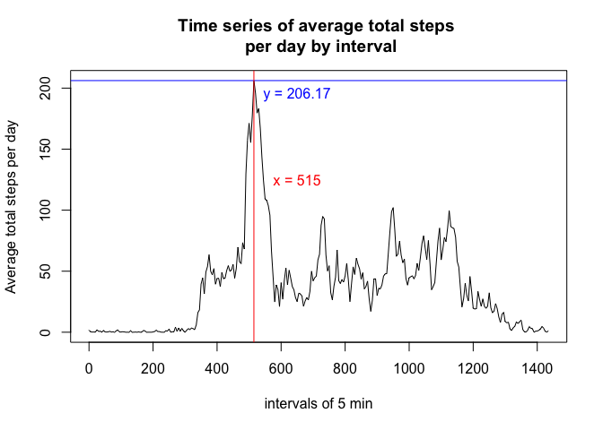

# Reproducible Research: Peer Assessment 1
Georges Bressange  


## Loading and preprocessing the data
1. The zip file, as stated in the peer assesment instructions, is already 
present in the working directory. We unzip it:


```r
unzip("activity.zip")
```

Then, we read the zip file to produce the analytic data frame we will 
later use to perform statistic analysis:


```r
activity <- read.csv("activity.csv")
```


```r
str(activity)
```

```
## 'data.frame':	17568 obs. of  3 variables:
##  $ steps   : int  NA NA NA NA NA NA NA NA NA NA ...
##  $ date    : Factor w/ 61 levels "2012-10-01","2012-10-02",..: 1 1 1 1 1 1 1 1 1 1 ...
##  $ interval: int  0 5 10 15 20 25 30 35 40 45 ...
```

2. We convert the factor "date" to a date format:


```r
activity$date <- as.Date(activity$date, format = "%Y-%m-%d")
```


```r
str(activity)
```

```
## 'data.frame':	17568 obs. of  3 variables:
##  $ steps   : int  NA NA NA NA NA NA NA NA NA NA ...
##  $ date    : Date, format: "2012-10-01" "2012-10-01" ...
##  $ interval: int  0 5 10 15 20 25 30 35 40 45 ...
```

The "interval" variable is not an arithmetic suite of time: after the 55 minute interval, the id interval jumps to 100 as we can see from the command:


```r
unique(activity$interval)
```

```
##   [1]    0    5   10   15   20   25   30   35   40   45   50   55  100  105
##  [15]  110  115  120  125  130  135  140  145  150  155  200  205  210  215
##  [29]  220  225  230  235  240  245  250  255  300  305  310  315  320  325
##  [43]  330  335  340  345  350  355  400  405  410  415  420  425  430  435
##  [57]  440  445  450  455  500  505  510  515  520  525  530  535  540  545
##  [71]  550  555  600  605  610  615  620  625  630  635  640  645  650  655
##  [85]  700  705  710  715  720  725  730  735  740  745  750  755  800  805
##  [99]  810  815  820  825  830  835  840  845  850  855  900  905  910  915
## [113]  920  925  930  935  940  945  950  955 1000 1005 1010 1015 1020 1025
## [127] 1030 1035 1040 1045 1050 1055 1100 1105 1110 1115 1120 1125 1130 1135
## [141] 1140 1145 1150 1155 1200 1205 1210 1215 1220 1225 1230 1235 1240 1245
## [155] 1250 1255 1300 1305 1310 1315 1320 1325 1330 1335 1340 1345 1350 1355
## [169] 1400 1405 1410 1415 1420 1425 1430 1435 1440 1445 1450 1455 1500 1505
## [183] 1510 1515 1520 1525 1530 1535 1540 1545 1550 1555 1600 1605 1610 1615
## [197] 1620 1625 1630 1635 1640 1645 1650 1655 1700 1705 1710 1715 1720 1725
## [211] 1730 1735 1740 1745 1750 1755 1800 1805 1810 1815 1820 1825 1830 1835
## [225] 1840 1845 1850 1855 1900 1905 1910 1915 1920 1925 1930 1935 1940 1945
## [239] 1950 1955 2000 2005 2010 2015 2020 2025 2030 2035 2040 2045 2050 2055
## [253] 2100 2105 2110 2115 2120 2125 2130 2135 2140 2145 2150 2155 2200 2205
## [267] 2210 2215 2220 2225 2230 2235 2240 2245 2250 2255 2300 2305 2310 2315
## [281] 2320 2325 2330 2335 2340 2345 2350 2355
```

The series of time intervals and those we would like to have are then:

| Series of 5 min intervals   | New Series of 5 min intervals|
| ----------------------------| ----------------------------|
| 0 - 5 - 10 -  ...      - 55 | 0 - 5 - 10 -  ...      - 55 |
| 100 - 105 - 110 - ... - 155 | 60 - 65 - 70 - ...    - 115 |
| 200 - 205 - 210 - ... - 255 | 120 - 125 - 130 - ... - 175 |
| 300 - 305 - 310 - ... - 355 | 180 - 185 - 190 - ... - 235 |
| ........................... | ........................... |
| 2300 - 2305 - ... -    2355 | 1380 - 1385 - ... -    1435 |

A mathematical function to make this transformation is


```r
fint <- function(x){x - 40*floor(x/100)}
```

where floor(y) is the integer part of a real number y.

Using the mutate function of the dplyr library, let us transform the interval variable according to previous function:


```r
library(dplyr)
```

```r
activity <- mutate(activity, interval = fint(interval))
```


```r
unique(activity$interval)
```

```
##   [1]    0    5   10   15   20   25   30   35   40   45   50   55   60   65
##  [15]   70   75   80   85   90   95  100  105  110  115  120  125  130  135
##  [29]  140  145  150  155  160  165  170  175  180  185  190  195  200  205
##  [43]  210  215  220  225  230  235  240  245  250  255  260  265  270  275
##  [57]  280  285  290  295  300  305  310  315  320  325  330  335  340  345
##  [71]  350  355  360  365  370  375  380  385  390  395  400  405  410  415
##  [85]  420  425  430  435  440  445  450  455  460  465  470  475  480  485
##  [99]  490  495  500  505  510  515  520  525  530  535  540  545  550  555
## [113]  560  565  570  575  580  585  590  595  600  605  610  615  620  625
## [127]  630  635  640  645  650  655  660  665  670  675  680  685  690  695
## [141]  700  705  710  715  720  725  730  735  740  745  750  755  760  765
## [155]  770  775  780  785  790  795  800  805  810  815  820  825  830  835
## [169]  840  845  850  855  860  865  870  875  880  885  890  895  900  905
## [183]  910  915  920  925  930  935  940  945  950  955  960  965  970  975
## [197]  980  985  990  995 1000 1005 1010 1015 1020 1025 1030 1035 1040 1045
## [211] 1050 1055 1060 1065 1070 1075 1080 1085 1090 1095 1100 1105 1110 1115
## [225] 1120 1125 1130 1135 1140 1145 1150 1155 1160 1165 1170 1175 1180 1185
## [239] 1190 1195 1200 1205 1210 1215 1220 1225 1230 1235 1240 1245 1250 1255
## [253] 1260 1265 1270 1275 1280 1285 1290 1295 1300 1305 1310 1315 1320 1325
## [267] 1330 1335 1340 1345 1350 1355 1360 1365 1370 1375 1380 1385 1390 1395
## [281] 1400 1405 1410 1415 1420 1425 1430 1435
```

We see now that the last 5 minute interval is 1435-1440 which is coherent since in a day there are 1440 minutes (24 times 60).

## What is mean total number of steps taken per day?
1. Let us calculate the total number of steps taken per day in "activity":


```r
library(dplyr)
```


```r
totalnumbersteps1 <- summarise(group_by(activity, date), total.steps.daily = sum(steps, na.rm = TRUE))
```

We use the command kabble to present the table of results:


```r
library(knitr)
```


```r
kable(totalnumbersteps1)
```


date          total.steps.daily
-----------  ------------------
2012-10-01                    0
2012-10-02                  126
2012-10-03                11352
2012-10-04                12116
2012-10-05                13294
2012-10-06                15420
2012-10-07                11015
2012-10-08                    0
2012-10-09                12811
2012-10-10                 9900
2012-10-11                10304
2012-10-12                17382
2012-10-13                12426
2012-10-14                15098
2012-10-15                10139
2012-10-16                15084
2012-10-17                13452
2012-10-18                10056
2012-10-19                11829
2012-10-20                10395
2012-10-21                 8821
2012-10-22                13460
2012-10-23                 8918
2012-10-24                 8355
2012-10-25                 2492
2012-10-26                 6778
2012-10-27                10119
2012-10-28                11458
2012-10-29                 5018
2012-10-30                 9819
2012-10-31                15414
2012-11-01                    0
2012-11-02                10600
2012-11-03                10571
2012-11-04                    0
2012-11-05                10439
2012-11-06                 8334
2012-11-07                12883
2012-11-08                 3219
2012-11-09                    0
2012-11-10                    0
2012-11-11                12608
2012-11-12                10765
2012-11-13                 7336
2012-11-14                    0
2012-11-15                   41
2012-11-16                 5441
2012-11-17                14339
2012-11-18                15110
2012-11-19                 8841
2012-11-20                 4472
2012-11-21                12787
2012-11-22                20427
2012-11-23                21194
2012-11-24                14478
2012-11-25                11834
2012-11-26                11162
2012-11-27                13646
2012-11-28                10183
2012-11-29                 7047
2012-11-30                    0

2. We now plot an histogram of the total number of steps taken each day using 
ggplot2 (we have interpreted "each day" as "each of the 61 days" since the 
instructions don't ask for "each day of the week"). NA values have been 
ignored. A word on the differences between histogram and barplot: an histogram 
is used to describe the ditribution of one quantitative variable. A barplot is used 
to compare several categorical variables. Here, we want to study the distribution 
of the "steps" variable but this variable is partially already counted so we 
have used a barplot to be able to specify the counted steps on the y-axis.


```r
library(ggplot2)
```


```r
g <- ggplot(data = activity, aes(date, steps))
g + stat_summary(fun.y = sum, geom = "bar", na.rm = TRUE)
```

<!-- -->
 
3. We now report the mean and median total number of steps taken per day. The dplyr 
package has already been loaded. We summarize with the following naming: 
the mean total number of steps per day is "mean.steps.daily" and the  the median 
total number of steps per day is "median.steps.daily":


```r
report1 <- summarise(activity, mean.steps.daily = mean(steps, na.rm = TRUE),
                 median.steps.daily = median(steps, na.rm = TRUE))
```


```r
knitr::kable(report1)
```


 mean.steps.daily   median.steps.daily
-----------------  -------------------
          37.3826                    0

The anonymous individual performs around 37 steps 
per day and the fact that the median total number of steps per day is zero means 
that for at least 50% of the days in these two months, the anonymous individual 
don't perform any step (or no steps were recorded 50% of the time).

## What is the average daily activity pattern?
1. We group similar interval of 5 mins along the days. The resulting data frame 
is called "activity_by_intervals".


```r
activity_by_intervals <- aggregate(activity, by = list(activity$interval), 
                             FUN = "mean", na.rm = TRUE)
activity_by_intervals <- select(activity_by_intervals, interval, steps)
activity_by_intervals <- rename(activity_by_intervals, 
                                average.steps.by.interval = steps)
```


```r
summary(activity_by_intervals)
```

```
##     interval      average.steps.by.interval
##  Min.   :   0.0   Min.   :  0.000          
##  1st Qu.: 358.8   1st Qu.:  2.486          
##  Median : 717.5   Median : 34.113          
##  Mean   : 717.5   Mean   : 37.383          
##  3rd Qu.:1076.2   3rd Qu.: 52.835          
##  Max.   :1435.0   Max.   :206.170
```

We now make a time series plot (type = "l") of the 5-minute interval (x-axis) and 
the average number of steps taken, averaged across all days (y-axis)


```r
plot(activity_by_intervals$interval, activity_by_intervals$average.steps.by.interval, 
     type = "l", xlab = "intervals of 5 min", 
     ylab = "Average total steps per day", 
     main ="Time series average total steps \n per day by interval")
```

<!-- -->

2. The 5-minute interval, on average across all the days in the dataset, 
contains the maximum number of steps can be obtained by the following 
commands, performed on the dataset "activity_by_intervals":


```r
M <- max(activity_by_intervals$average.steps.by.interval) ## calculates the maximum average steps in the series of intervals
n <- activity_by_intervals[
        activity_by_intervals$average.steps.by.interval == M,]$interval ## gives the time interval where this maximum occurs
activity_by_intervals[activity_by_intervals$average.steps.by.interval == M,]
```

```
##     interval average.steps.by.interval
## 104      515                  206.1698
```

The 5-minute interval which, on average across all the days in the dataset, 
that contains the maximum number of steps is the interval 515 i.e., after 
time conversion, between 08h00 and 08h05. To confirm that, we ploted again 
the time series presented in 1. by adding a blue horizontal line 
corresponding to the maximum of steps (y = 206.1698113) end a red vertical line 
corresponding to the interval where this maximum occurs (x = 515).


```r
plot(activity_by_intervals$interval, activity_by_intervals$average.steps.by.interval, 
     type = "l", xlab = "intervals of 5 min", 
     ylab = "Average total steps per day", 
     main ="Time series of average total steps \n per day by interval")
abline(h = M, col = "blue")
abline(v = n, col = "red")
text(x = 650, y = 195, labels = "y = 206.17", col = "blue")
text(x = 650, y = 125, labels = "x = 515", col = "red")
```

<!-- -->

## Imputing missing values
1. Calculate and report the total number of missing values in the dataset 


```r
nasteps <- sum(is.na(activity$steps)) # number of NA in steps column
nadate <- sum(is.na(activity$date)) # number of NA in date column
nainterval <- sum(is.na(activity$interval)) # number of NA in interval column
nas <- data.frame(nasteps, nadate, nainterval)
nas
```

```
##   nasteps nadate nainterval
## 1    2304      0          0
```

The dataset "activity" contains 2304 missing values in total. These 
NA values are exclusively located in the "steps" column. This number of missing values can also be read from the summary command applied to "activity":


```r
summary(activity)
```

```
##      steps             date               interval     
##  Min.   :  0.00   Min.   :2012-10-01   Min.   :   0.0  
##  1st Qu.:  0.00   1st Qu.:2012-10-16   1st Qu.: 358.8  
##  Median :  0.00   Median :2012-10-31   Median : 717.5  
##  Mean   : 37.38   Mean   :2012-10-31   Mean   : 717.5  
##  3rd Qu.: 12.00   3rd Qu.:2012-11-15   3rd Qu.:1076.2  
##  Max.   :806.00   Max.   :2012-11-30   Max.   :1435.0  
##  NA's   :2304
```

2. Strategy for filling in all of the missing values in the dataset. 

We decide to replace each missing "steps"" value by the mean of the 5-minute interval 
to which they belong.

3. Creating a new dataset "activityfill" that is equal to the original dataset but with the missing data filled in.


```r
activityfill <- activity ## creating a new dataset
listNAintervals <- activityfill$interval[is.na(activityfill$steps)] ## list the values of time intervals corresponding to the missing steps values
f <- function(x){
        subset(activity_by_intervals, interval == x)$average.steps.by.interval
} 
activityfill$steps[is.na(activityfill$steps)] <- sapply(listNAintervals, f) ## the function f will replace each missing steps value in "activity" by the corresponding average.steps.by.interval extracted from "activity_by_intervals".
```

4. Histogram of the total number of steps taken each day:
We use the same plot command as used for "activity" dataset.


```r
g <- ggplot(data = activityfill, aes(date, steps))
g + stat_summary(fun.y = sum, geom = "bar", na.rm = TRUE)
```

<!-- -->

We now report the mean and median total number of steps taken per day. 


```r
report2 <- summarise(activityfill, mean.steps.daily = mean(steps, na.rm = TRUE),
                 median.steps.daily = median(steps, na.rm = TRUE))
```


```r
knitr::kable(report2)
```


 mean.steps.daily   median.steps.daily
-----------------  -------------------
          37.3826                    0

These values don't differ from the estimates from the first part of the assignment.

Let us calculate the total number of steps taken per day in "activityfill":


```r
totalnumbersteps2 <- summarise(group_by(activityfill, date), total.steps.daily = sum(steps, na.rm = TRUE))
head(totalnumbersteps2)
```

```
## # A tibble: 6 x 2
##         date total.steps.daily
##       <date>             <dbl>
## 1 2012-10-01          10766.19
## 2 2012-10-02            126.00
## 3 2012-10-03          11352.00
## 4 2012-10-04          12116.00
## 5 2012-10-05          13294.00
## 6 2012-10-06          15420.00
```

As a result of imputing missing values, we calculate below the average of the increase of the total number of steps per day:


```r
impactfill <- data.frame(date = totalnumbersteps1$date, 
                         daily.increase = totalnumbersteps2$total.steps.daily -    
                                 totalnumbersteps1$total.steps.daily)
report3 <- summarise(impactfill, mean.daily.increase = mean(daily.increase), 
          median.daily.increase = median(daily.increase))
meanincreasesteps <- report3$mean.daily.increase
head(report3)
```

```
##   mean.daily.increase median.daily.increase
## 1            1411.959                     0
```

Therefore, we see that in average, the daily total number of steps has increased from 
around 1412 steps.

## Are there differences in activity patterns between weekdays and weekends?

1. We create a new factor variable in the dataset with two levels – “weekday” and “weekend” indicating whether a given date is a weekday or weekend day.

The following code is useful because my locales are french and I want to obtain weekdays in english.


```r
curr_locale <- Sys.getlocale("LC_TIME")
Sys.setlocale("LC_TIME","en_US.UTF-8")
```

```
## [1] "en_US.UTF-8"
```

Creating the weekdays factor variable:


```r
weekdayslist <- c('Monday', 'Tuesday', 'Wednesday', 'Thursday', 'Friday')
activityfill$weekDay <- factor((weekdays(activityfill$date) %in% weekdayslist), 
                               levels=c(FALSE, TRUE), labels=c('weekend', 'weekday')) 
```

Let us group similar interval of 5 mins along the days. The resulting data frame 
is called "activityfill_by_intervals".


```r
by_weekdays_and_interval <- group_by(activityfill, weekDay, interval)
activityfill_by_intervals <- summarise(by_weekdays_and_interval, average.total.daily.steps = mean(steps, na.rm = TRUE))
```

2. Ploting the time series of the 5-minute interval (x-axis) and the average number of steps taken, averaged across all weekday days or weekend days (y-axis):


```r
g <- ggplot(data = activityfill_by_intervals, aes(interval, average.total.daily.steps))
g + geom_line() + facet_wrap(~weekDay, nrow = 2) + xlab("5 minutes intervals") +
        ggtitle("Time Series of average total steps \n per day by interval")
```

<!-- -->

**Conclusion**: the weekdays and weekend activity patterns  are slightly different. They share a maximum intensity around interval 515 (08h00 - 08h05) but in the afternoon and evening, the weekend activity is globally more intense.
